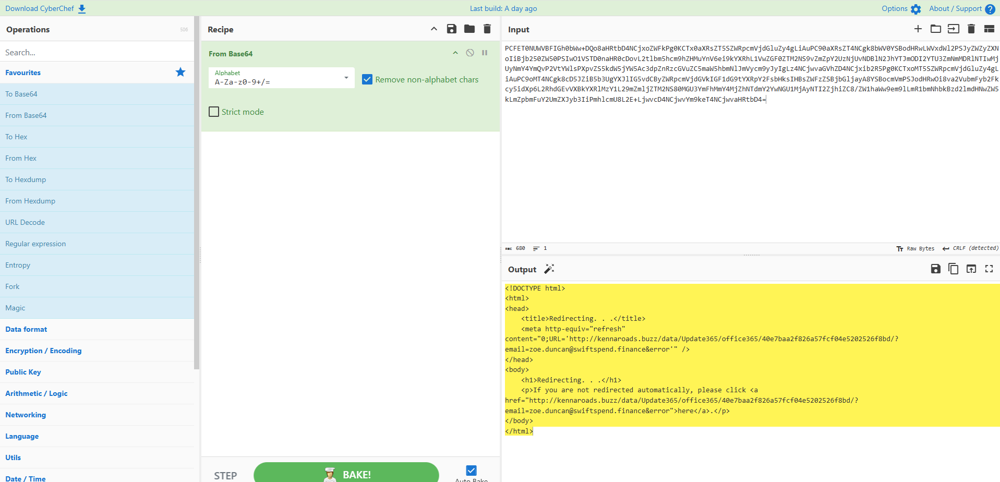
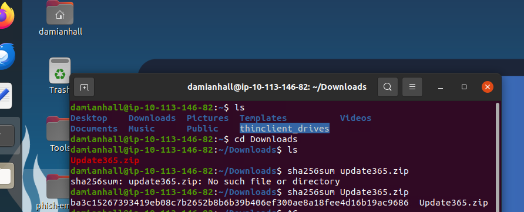
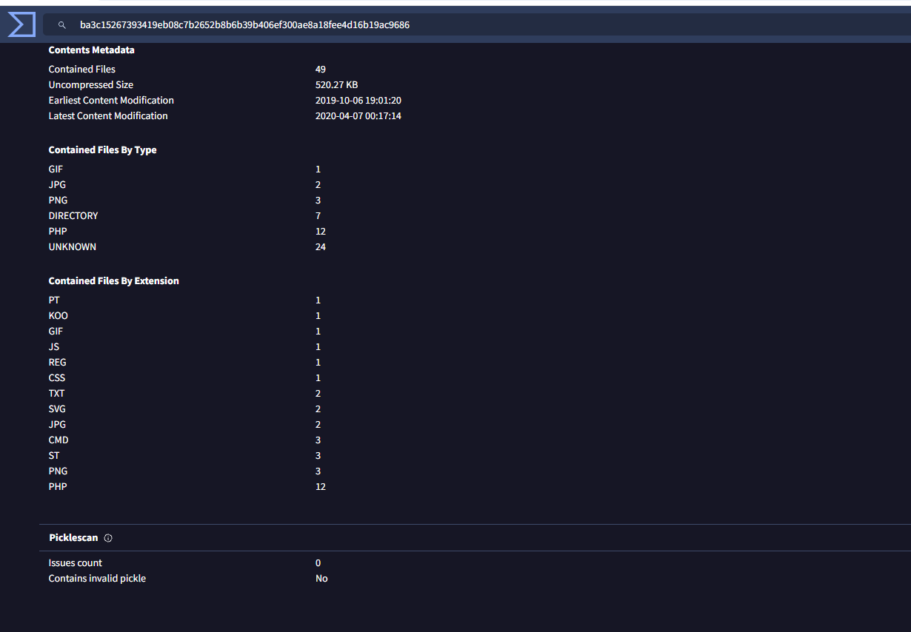
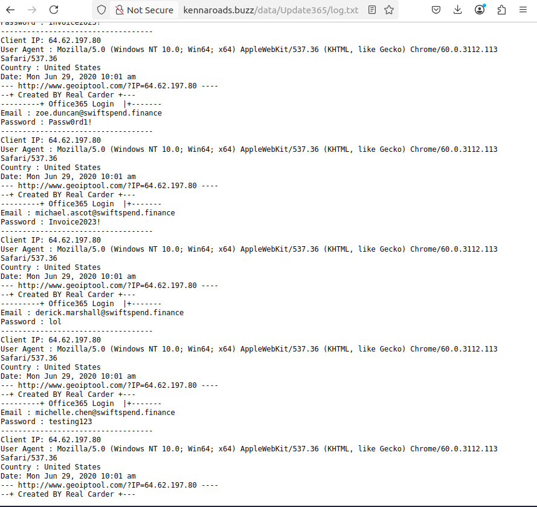
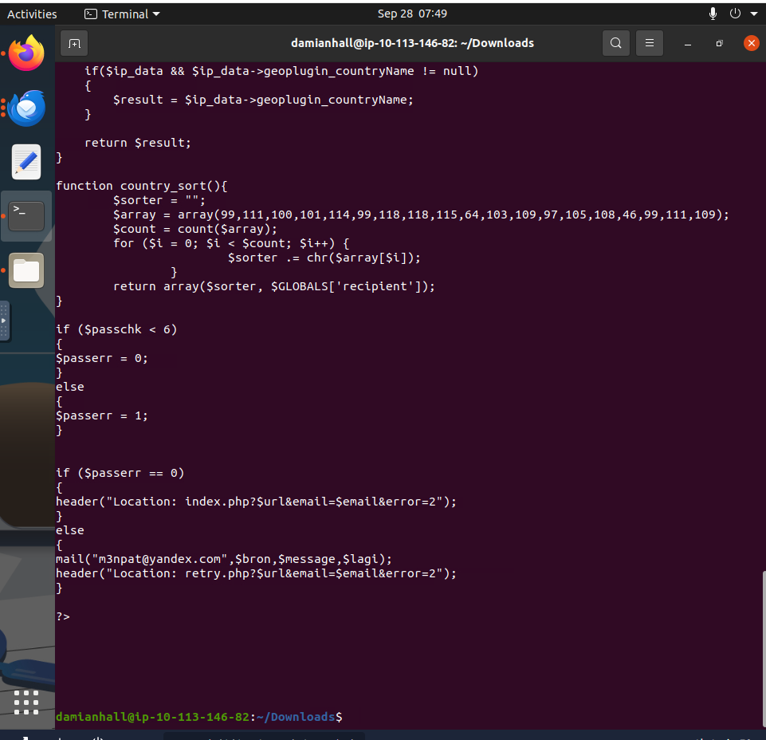

# Credential Phishing Kit Investigation

## Executive Summary

This project documents an end-to-end investigation of a credential-phishing campaign targeting users within a controlled financial-services lab environment.
The investigation began with suspicious payment-themed emails and progressed beyond traditional email triage into analysis of an HTML attachment, Base64 decoding, redirect infrastructure, a Microsoft credential-harvesting page, exposed adversary infrastructure, and the underlying phishing kit.

Analysis of the phishing kit identified captured credential records and server-side PHP logic configured to transmit compromised information to an external email address.

The investigation demonstrates the correlation of email, web, file, threat-intelligence, and source-code evidence to understand the complete phishing attack chain and develop actionable indicators for detection and response.

---

## Investigation Scope

The investigation focused on:

- Email and attachment analysis
- MIME and Base64 analysis
- HTML redirect analysis
- Credential-harvesting infrastructure
- Phishing kit acquisition and examination
- SHA-256 file hashing
- Threat intelligence using VirusTotal
- Captured credential analysis
- PHP source-code analysis
- Indicator of Compromise (IOC) extraction
- MITRE ATT&CK mapping
- SOC containment and response recommendations

---

## Attack Chain

```text
Phishing Email
      ↓
HTML Attachment
      ↓
Base64-Encoded Payload
      ↓
HTML META Redirect
      ↓
External Phishing Infrastructure
      ↓
Microsoft Credential-Harvesting Page
      ↓
Credential Submission
      ↓
Server-Side PHP Processing
      ↓
Credential Collection / Exfiltration
```

---

## Email & Attachment Analysis

The campaign used a payment-themed email originating from:

`Accounts.Payable@groupmarketingonline[.]icu`

One message contained an HTML attachment named:

`Direct Credit Advice.html`

Rather than relying on the attachment's displayed content, the raw email source was examined.

MIME analysis identified:

`Content-Transfer-Encoding: base64`

The encoded HTML payload was extracted and decoded using CyberChef.

Analysis of the decoded HTML identified an automatic META refresh redirecting the browser to infrastructure hosted under:

`kennaroads[.]buzz`

This established the connection between the email attachment and the external phishing infrastructure.

### Evidence — HTML Attachment Analysis



*Base64-encoded HTML attachment decoded and analyzed to identify the embedded phishing redirect.*

---

## Credential-Harvesting Infrastructure

The redirect destination presented a Microsoft-branded authentication page requesting the user's password.

Although the page visually impersonated Microsoft, it was hosted on the unrelated domain:

`kennaroads[.]buzz`

This confirmed that the infrastructure was being used for credential harvesting.
### Evidence — Credential-Harvesting Page



*Microsoft-branded credential-harvesting page hosted on phishing infrastructure unrelated to the legitimate Microsoft domain.*
---

## Phishing Kit Discovery

Further investigation of the exposed web infrastructure identified an accessible archive:

`Update365.zip`

The archive was downloaded into the controlled analysis environment and fingerprinted using SHA-256.

### Evidence — Phishing Kit & Threat Intelligence Analysis



*SHA-256 fingerprinting and threat-intelligence analysis were used to validate and characterize the exposed phishing-kit archive.*

### SHA-256

```text
ba3c15267393419eb08c7b2652b8b6b39b406ef300ae8a18fee4d16b19ac9686
```

The hash was subsequently investigated using VirusTotal.

Archive metadata identified **49 contained files**, including PHP, JavaScript, CSS, images, and other supporting resources associated with the phishing infrastructure.

---

## Credential Capture Analysis

An exposed server-side log contained credential submissions and associated metadata.

The records included information such as:

- Email address
- Client IP
- User agent
- Country
- Timestamp

Analysis showed repeated credential submission associated with one affected account, providing evidence that the phishing infrastructure was actively recording victim input.

### Evidence — Credential Capture Analysis



*Analysis of the exposed credential-capture log identified multiple victim submissions and associated metadata, including email addresses, source IP addresses, user agents, geographic information, and timestamps. Repeated submissions associated with the same account provided evidence of multiple credential-entry attempts.*
Sensitive credential values have intentionally been excluded from this public repository.

---

## Phishing Kit Source-Code Analysis

The phishing kit was extracted and its PHP components were reviewed.

Static analysis of `submit.php` identified a PHP `mail()` function configured to transmit captured information to an external email address.

The identified collection address was:

`m30pat@yandex[.]com`

This provided an additional adversary-controlled indicator directly from the phishing kit's server-side logic.

### Evidence — Server-Side Source-Code Analysis



*Static analysis of `submit.php` identified the PHP `mail()` function and the external email address configured to receive captured information.*

---

## Indicators of Compromise

| Type | Indicator |
|---|---|
| Sender | `Accounts.Payable@groupmarketingonline[.]icu` |
| Phishing Domain | `kennaroads[.]buzz` |
| Attachment | `Direct Credit Advice.html` |
| Phishing Kit | `Update365.zip` |
| SHA-256 | `ba3c15267393419eb08c7b2652b8b6b39b406ef300ae8a18fee4d16b19ac9686` |
| Credential Collection Email | `m30pat@yandex[.]com` |

## Indicators of Compromise (IOCs)

The following indicators were identified and correlated during the investigation:

| IOC Type | Indicator | Investigation Context |
|---|---|---|
| Sender Email | `Accounts.Payable@groupmarketingonline[.]icu` | Sender associated with the phishing campaign |
| Phishing Domain | `kennaroads[.]buzz` | Hosted the redirect and credential-harvesting infrastructure |
| Malicious Attachment | `Direct Credit Advice.html` | HTML attachment containing the encoded redirect |
| Phishing Kit | `Update365.zip` | Exposed archive containing the phishing-kit components |
| SHA-256 | `ba3c15267393419eb08c7b2652b8b6b39b406ef300ae8a18fee4d16b19ac9686` | Cryptographic fingerprint of the phishing-kit archive |
| Credential Collection Email | `m30pat@yandex[.]com` | External address identified in `submit.php` for receiving captured information |
---

## MITRE ATT&CK Mapping

| Technique | ID | Tactic |
|---|---|---|
| Spearphishing Attachment | T1566.001 | Initial Access |
| Input Capture: Web Portal Capture | T1056.003 | Credential Access |

## MITRE ATT&CK Mapping

Observed adversary behavior was mapped to the MITRE ATT&CK framework based on evidence recovered during the investigation.

| Tactic | Technique | Technique ID | Evidence |
|---|---|---|---|
| Initial Access | Phishing: Spearphishing Attachment | T1566.001 | A payment-themed phishing email delivered `Direct Credit Advice.html`, which contained an encoded redirect to attacker-controlled infrastructure. |
| Credential Access / Collection | Input Capture: Web Portal Capture | T1056.003 | The phishing infrastructure presented a Microsoft-branded login page designed to collect submitted credentials. Captured submissions were subsequently identified in the exposed server-side log. |

### ATT&CK Analysis

The observed attack chain demonstrates a progression from **Initial Access** to **Credential Access**.

The adversary used an HTML attachment as the initial phishing delivery mechanism. Analysis of the attachment revealed a redirect to attacker-controlled infrastructure hosting a Microsoft-branded credential-harvesting page.

Victim input submitted through the fraudulent authentication portal was captured by the phishing infrastructure, with server-side artifacts providing additional evidence of credential collection.

This mapping is limited to techniques directly supported by the available investigation evidence.
---

- ## Recommended SOC Response

Based on the confirmed credential-phishing activity and evidence of credential submission, the following response actions are recommended:

### Immediate Containment

- Reset passwords for confirmed affected accounts.
- Revoke active sessions, refresh tokens, and other authentication tokens associated with compromised accounts.
- Block `kennaroads[.]buzz` and associated phishing URLs across DNS, proxy, firewall, and secure web gateway controls.
- Block the identified phishing sender and related campaign indicators at the email security gateway.
- Remove matching phishing emails from organizational mailboxes.

### Identity & Account Investigation

- Review Entra ID or identity-provider sign-in logs for suspicious authentication activity associated with affected users.
- Investigate unfamiliar source IP addresses, devices, geographic locations, and abnormal sign-in patterns.
- Review affected accounts for unauthorized MFA changes or authentication-method registration.
- Examine mailbox forwarding rules, inbox rules, suspicious sent messages, and unauthorized OAuth application consent.

### Enterprise Threat Hunting

- Search email telemetry for additional recipients of the campaign.
- Identify users who accessed `kennaroads[.]buzz`.
- Hunt across proxy, DNS, firewall, EDR, and SIEM telemetry for identified IOCs.
- Search for additional activity associated with the phishing-kit SHA-256 and related infrastructure.

### Evidence Preservation & Escalation

- Preserve the original phishing emails, headers, HTML attachments, phishing-kit archive, file hashes, relevant logs, and investigation artifacts.
- Document affected accounts, observed activity, containment actions, and investigation timelines.
- Escalate confirmed account compromise according to established incident-response procedures.
- Engage privacy, legal, compliance, or other stakeholders where the investigation identifies potential exposure of regulated or sensitive information.

---

## Tools & Technologies

| Tool / Technology | Application in the Investigation |
|---|---|
| Email Message Source Analysis | Examined MIME structure, attachment metadata, and encoded email content |
| CyberChef | Decoded the Base64-encoded HTML attachment and analyzed the redirect logic |
| Linux CLI | Extracted the phishing kit, located artifacts, reviewed source files, and generated the SHA-256 hash |
| VirusTotal | Correlated the phishing-kit hash with threat-intelligence and archive metadata |
| Web Browser / Controlled VM | Investigated the phishing infrastructure and credential-harvesting page |
| PHP Source-Code Analysis | Examined `submit.php` to identify credential collection and exfiltration logic |
| MITRE ATT&CK | Mapped observed adversary behavior to supported techniques |

---

## Conclusion

This investigation reconstructed an end-to-end credential-phishing operation from initial email delivery through credential capture and adversary-controlled collection infrastructure.

Analysis of the phishing email identified an HTML attachment containing Base64-encoded content. Decoding the attachment exposed a redirect to `kennaroads[.]buzz`, where a Microsoft-branded credential-harvesting page was hosted.

Further investigation of the exposed infrastructure identified the `Update365.zip` phishing kit. SHA-256 fingerprinting and threat-intelligence analysis provided additional context on the archive, while examination of the exposed credential log confirmed that victim submissions were being recorded.

Static analysis of the phishing kit's server-side PHP code subsequently identified `m30pat@yandex[.]com` as the external address configured to receive captured information.

The final assessment was based on correlation across multiple evidence sources rather than any single indicator:

**Email artifacts → Encoded HTML → Redirect infrastructure → Credential-harvesting page → Phishing kit → Threat intelligence → Captured submissions → Server-side collection logic**

The investigation demonstrates how extending phishing analysis beyond the original email can uncover additional adversary infrastructure, victim-impact evidence, and actionable indicators that support containment, threat hunting, and incident response.

---


> **Environment Note:** This investigation was conducted in a controlled, non-production cybersecurity lab. All identities, credentials, infrastructure, and incident data shown as part of the scenario are fictitious or lab-generated.

